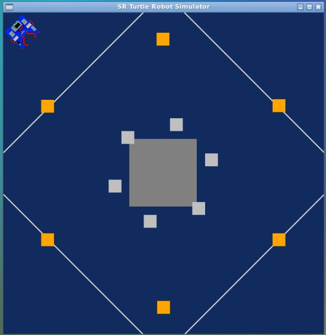
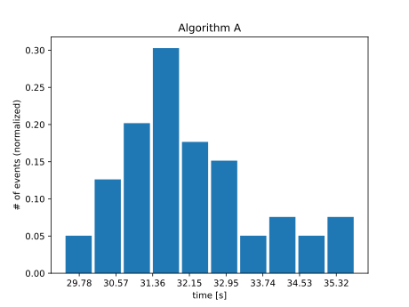
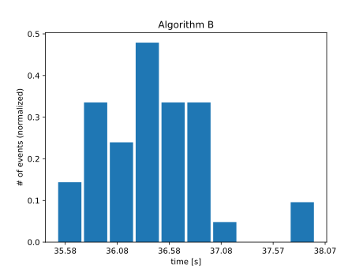

Exercise on Python Robotics Simulator
=====================================
With reference to the [first assignment](https://github.com/davideCaligola/rt1_assignment1) of the course Research Track 1, the aim of this assignment is to verify if , given the two algorithms [A]() and [B](), the average sorting time of a robot driven by algorithm A is lower than the average sorting time of the robot driven by algorithm B. To verify statistically such a statement, a hypothesis testing is performed.  
The used code is implemented under the folder [robot-sim](./robot-sim/).

Hypothesis statement
--------------------
The following null and alternative hypotheses are considered:

$H_0: \mu_b = \mu_a$  
$H_a: \mu_b > \mu_a$

where $μ_a$ and $μ_b$ are respectively the average sorting time of the robot driven by Algorithm A and B.

Test setup
----------
* The configuration of the gold and silver blocks is the same for both algorithm and it is fixed  
* The number of blocks is the same for each algorithm and it is fixed  
* the starting point of the robot is the same for both algorithm  
* Each algorithm runs 50 times
* the required time to sort all the blocks is measured starting when the robot receives the first command to move and finishes when the algorithms states so  
* If the robot is not able to complete the task, because it gets stuck, such a run is discarded  

The blocks layout and the starting position is shown in the following figure:  


      <p >Blocks layout and starting position</p>

Statistical test
----------------
Since the planned sample size is 50, it is possible to assume, at least preliminarily, that the samples will have a normal distribution. For this reason, a parametric hypothesis test is chosen. the normality of each sample distribution will be later on verified with the Lilliefors test.  
The hypothesis to verify the relationship between two statistics of different samples, thus a two-sample  T-test is chosen.  
Since the alternative hypothesis is a inequality, a one-tailed hypothesis test is considered.  

Data recording
--------------
The samples are collected as specified in section [Test setup](#test-setup) and the sorting times of algorithm A are recorded in [times_a.txt](./robot-sim/times_a.txt), whereas times related to algorithm B are saved in [times_b.txt](./robot-sim/times_b.txt).  
To be noticed that algorithm B failed to sort the blocks 8 times, thus algorithm A has a sample of size $n_a=50$, where as algorithm B has a sample size $n_b=42$.

Lilliefors test
---------------
The collected samples for each algorithm are represented in the following histograms:

<table>
  <tr>
    <td>
      
      <p>Algorithm A sample</p>
    </td>
    <td>
      
      <p >Algorithm B sample</p>
    </td>
  </tr>
</table>

The normal distribution of the samples are verified using the Lilliefors test, considering a significance level $\alpha=0.01$.  
For algorithm A
```bash
Lilliefors: Normal
p-value: 0.17219
```
For algorithm B
```bash
Lilliefors: Normal
p-value: 0.61752
```
Both have a p-value greater than the significance level, thus the null hypothesis that the sample come from a normal distribution cannot be rejected.  
Since both samples have a normal distribution, a T-test single-tailed can be applied.  

Two-samples T-test (single-tailed)
----------------------------------
The collected samples have the following means and variances
<table>
  <tr>
    <td></td><td></td><td></td>
  </tr>
  <tr>
    <td>
      <p>&mu;<sub>a</sub> = 32.01</p>
    </td>
    <td>
      <p>&sigma;<sub>a</sub><sup>2</sup> = 3.44</p>
    </td>
    <td>
      <p>n<sub>a</sub> = 50</p>
    </td>
  </tr>
  <tr>
    <td>
      <p>&mu;<sub>b</sub> = 36.70</p>
    </td>
    <td>
      <p>&sigma;<sub>b</sub><sup>2</sup> = 1.06</p>
    </td>
    <td>
      <p>n<sub>b</sub> = 42</p>
    </td>
  </tr>
  <tr>
    <td></td><td></td><td></td>
  </tr>
</table>

The pooled estimated variance of the difference of the means is given by  

$\hat{\sigma}_{pooled}^2 = \frac{(n_a-1)\sigma^2_a + (n_b-1)\sigma^2_b}{n_a + n_b -2} = 3.356$

The estimated standard error is thus

$\hat{\sigma}^2_{\mu_b-\mu_a} = \sqrt{\hat{\sigma}_{pooled}^2(\frac{1}{n_a} + \frac{1}{n_b})} = 0.321$

The t-statistics is given by

$t_{\mu_b-\mu_a}=\frac{\mu_b-\mu_a}{\hat{\sigma}^2_{\mu_b-\mu_a}} = 14.60$

Considering a significance level $\alpha=0.01$ and a number of degree of freedom $DoF=n_a+n_b-2=90$, the critical value is 2.368. It is considered a positive value, since it has been considered the difference $\mu_b-\mu_a$ with $\mu_b > \mu_a$

Conclusions
-----------
Since $t_{\mu_b-\mu_a} = 14.60 > 2.368$, the null hypothesis $H_0$ is rejected and can be stated that the sorting algorithm A, in the considered conditions and in average, is faster than the algorithm B with significance level $\alpha=0.01$.
